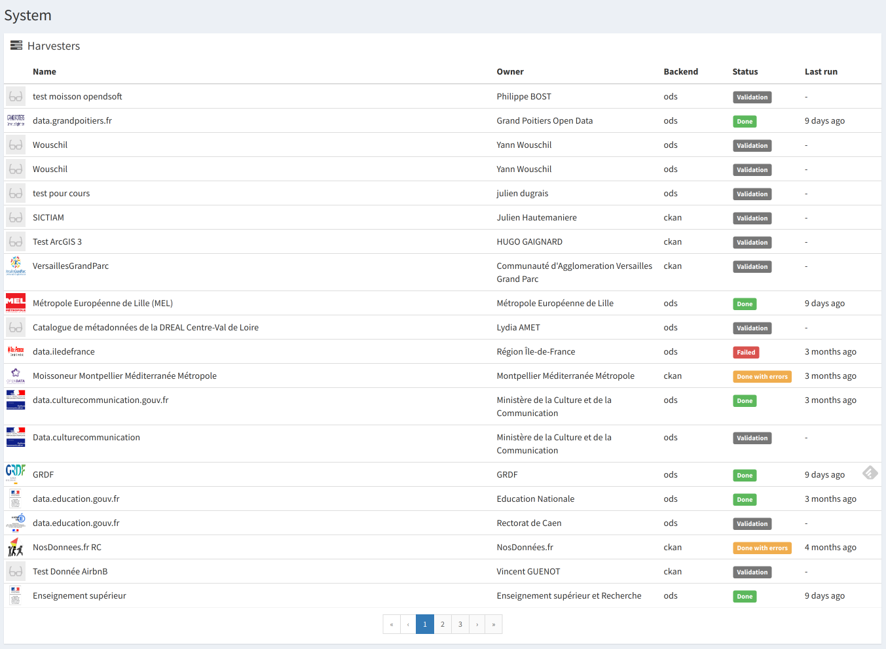
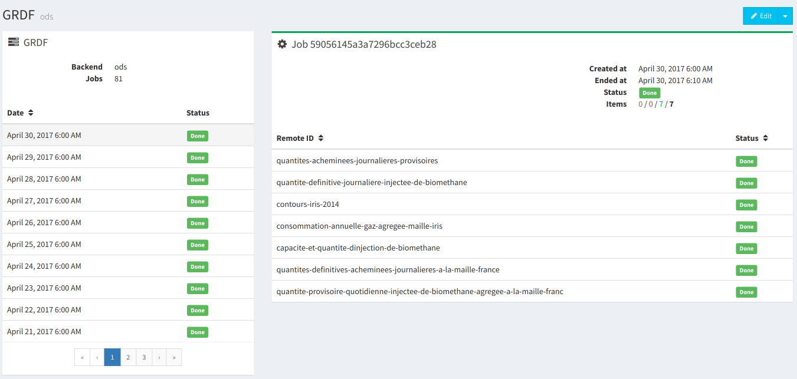

# Harvesting

Harvesting is the process of automatically fetching remote metadata (ie. from other data portals or not)
and storing them into udata to be able to search and find them.

## Vocabulary

- **Backend**: designate a protocol implementation to harvest a remote endpoint.
- **Source**: it's a remote endpoint to harvest. Each harvest source is caracterized by
  a single endpoint URL and a backend implementation. A harvester is configured for each source.
- **Job**: designate a full harvesting for a given source.
- **Validation**: each created harvester needs to be validated by the admin team before being run.

## Behavior

After a harvester for a given source has been created and validated,
it will run either on demand or periodically.

Running an harvester for a given source follows this pseudo-code in specific backends:
```
class MyHarvester(BaseBackend):
    @override
    def inner_harvest(self):
        for record in self.get_records_from_source():
            # Assuming all items are Datasets (otherwise use specialized processors)
            self.process_item(record.id, self.dataset_processor, ...)

    def get_records_from_source(self) -> Iterator:
        # Fetch and yield record ids (or full records) from the source
        yield record from ...

    def dataset_processor(self, harvest_item: HarvestItem, ...) -> Dataset:
        remote_id = harvest_item.remote_id  # record id on source

        # Get source record metadata for `remote_id` (from source or previously cached data)
        record = ...

        # Get (or create) datagouv item for `remote_id`
        dataset = self.get_item(remote_id, Dataset)

        # Update datagouv item with metadata from source record
        dataset.title = record.get("title")
        ...

        return dataset
```

The call to `process_item` is a wrapper that, for a given record, performs the following steps:
1. Create a new `HarvestItem` in the running job for the record.
2. Call the processor function (`dataset_processor` in pseudo-code above) on the record.
   That backend/type-specific processor function is responsible for:
   1. Calling `get_item` to retrieve/create the corresponding datagouv item.
   2. Updating (without saving!, see step 5) the datagouv item with the contents of the record.
   3. Returning the updated datagouv item.
3. Update the datagouv item `HarvestMetadata` with domain, source, last_update, etc.,
4. Catch any warning/error and record them in `HarvestItem`.
5. Save the updated datagouv item (except in "dry run" mode).

| Property            | Meaning                                                          |
|---------------------|------------------------------------------------------------------|
| harvest:domain      | Domain on which dataset has been harvested (ex: `data.test.org`) |
| harvest:remote_id   | Dataset identifier on the remote repository                      |
| harvest:source_id   | Harvester identifier                                             |
| harvest:last_update | Last time this dataset has been harvested                        |

## Administration interface

You can see the harvester administration interface in the `System` view.



You'll have an overview of all harvesters and their state (pending validation, last run...)

Each harvester have a full job history with every remote harvested items.



## Shell

All harvesting operations are grouped together into the `harvest` command namespace:

```shell
usage: udata harvest [-?]
                     {jobs,launch,create,schedule,purge,sources,backends,unschedule,run,validate,attach,delete}
                     ...

Handle remote repositories harvesting operations

positional arguments:
    jobs                List started harvest jobs
    launch              Launch a source harvesting on the workers
    create              Create a new harvest source
    schedule            Schedule a harvest job to run periodically
    purge               Permanently remove deleted harvest sources
    sources             List all harvest sources
    backends            List available backends
    unschedule          Unschedule a periodical harvest job
    run                 Run a harvester synchronously
    validate            Validate a source given its identifier
    attach              Attach existing datasets to their harvest remote id
    delete              Delete a harvest source

optional arguments:
  -?, --help            show this help message and exit
```

## Running harvests from the CLI

For local development and debugging, you can drive the full harvest pipeline from the shell.
The end-to-end flow is:

1. Enable the backend in `udata.cfg` (see [Backends](#backends))
2. Create a source pointing at a remote catalog
3. Validate the source
4. Run the harvest synchronously
5. Reindex search so harvested datasets become searchable

Backend names are lowercase and match the entry point names registered by each backend module.
You can list those available in your current install at any time with:

```shell
udata harvest backends
```

### Creating a source

```shell
udata harvest create <backend> <url> <name>
```

Arguments are positional, in this order: the backend name (lowercase, see above),
the catalog URL, and the human-readable name.

For example, to harvest the full data.gouv.fr catalog via DCAT:

```shell
udata harvest create dcat \
  "https://www.data.gouv.fr/api/1/site/catalog.xml" \
  "data.gouv.fr"
```

#### Finding the right URL

The DCAT backend expects a URL that returns RDF (any of RDF/XML, JSON-LD, Turtle, N3, NT, TriG) —
not an HTML page. Confirm before creating the source:

```shell
curl -IL -H "Accept: application/rdf+xml" <candidate-url>
```

The final response should be `200` with a `Content-Type` such as `application/rdf+xml` or
`application/ld+json`. If you get `text/html`, you're pointing at a frontend route — find the
underlying catalog endpoint via the portal's content-negotiation redirect.

### Listing and inspecting sources

```shell
udata harvest sources
```

The output includes the source name, slug, and backend. The slug is the identifier
you'll pass to subsequent commands.

### Validating

New sources are created in a pending state and must be validated before they can run:

```shell
udata harvest validate <slug>
```

### Running

For development, prefer the synchronous run:

```shell
udata harvest run <slug>
```

This processes the harvest in your current shell, surfacing logs and exceptions directly.
It does not require a Celery worker.

`udata harvest launch <slug>` queues the harvest as a Celery task and returns immediately.
Use this for scheduled or production scenarios where a worker is running.

### Limiting harvest size

When testing against a large remote catalog (e.g. data.gouv.fr's full catalog of tens of
thousands of datasets), cap the number of items per run via `udata.cfg`:

```python
HARVEST_MAX_ITEMS = 50
```

A small cap is strongly recommended on first runs while you verify the pipeline end-to-end.

### Scoping to an organization

Many udata-based portals expose per-organization catalogs at `/organizations/<slug>/catalog`.
These are dramatically smaller than the full portal catalog and often more useful for
development:

```shell
udata harvest create dcat \
  "https://www.data.gouv.fr/organizations/etalab/catalog.xml" \
  "Etalab datasets"
```

### Making harvested datasets searchable

Datasets are written to MongoDB incrementally as the harvest progresses. You can verify
they're arriving:

```shell
curl 'http://localhost:7000/api/1/datasets/'
```

However, full-text search uses a separate index (Elasticsearch/Meilisearch via
`udata-search-service`) which is not updated automatically by the harvest. After the harvest
completes, rebuild the index:

```shell
udata search index
```

Once indexed, search queries return results:

```shell
curl 'http://localhost:7000/api/1/datasets/?q=transport'
```

## Backends

`udata` comes with 3 harvest backends (listed below) but you can implement your own backend.
In order for `udata` to be able to use any of those backends, they first need to be enabled
in the `udata.cfg` `HARVESTER_BACKENDS` section, like so:

```cfg
HARVESTER_BACKENDS = ['dcat', 'csw*']
```

### DCAT

This backend harvest any [DCAT][] endpoint.
This is now the recommended way to harvest remote portals and repositories
(and so to expose opendata metadata for any portal and repository).

As pagination is not described into the DCAT specification, we try to detect some supported
pagination ontology:
- [Hydra PartialCollectionView](http://www.hydra-cg.com/spec/latest/core/#hydra:PartialCollectionView)
- [Legacy Hydra PagedCollection](https://www.w3.org/community/hydra/wiki/Pagination)

Fields are extracted according these rules:

#### Dataset fields

| Dataset           | dcat:Dataset            | notes                                       |
|-------------------|-------------------------|---------------------------------------------|
| title             | dct:title               |                                             |
| description       | dct:description         | Detect and parse HTML as Markdown           |
| tags              | dct:keyword + dct:theme |                                             |
| frequency         | dct:accrualPeriodicity  |                                             |
| temporal_coverage | dct:temporal            | See [Temporal coverage](#temporal-coverage) |
| license           | N/A                     | See [License detection](#license-detection) |
| resources         | dct:distribution        | Also match the buggy dct:distributions      |

| Dataset.extras | dcat:Dataset   | notes                    |
|----------------|----------------|--------------------------|
| dct:identifier | dct:identifier |                          |
| uri            | @id            | URI Reference if present |

#### Resource fields

| Resource      | dcat:Distribution                  | notes                                  |
|---------------|------------------------------------|----------------------------------------|
| title         | dct:title                          | If missing, guessed from URL or format |
| description   | dct:description                    | Detect and parse HTML                  |
| url           | dcat:downloadURL or dcat:accessURL |                                        |
| published     | dct:issued                         |                                        |
| last_modified | dct:modified                       |                                        |
| format        | dct:format                         |                                        |
| mime          | dcat:mediaType                     |                                        |
| filesize      | dcat:byteSize                     |                                        |
| checksum      | spdx:checksum                      | See [Checksum](#checksum)              |


#### Temporal coverage

Temporal coverage can be expressed in many ways. This harvester try the following patterns:
- DCAT-AP format using schema.org properties (`schema:startDate` and `schema:endDate`)
- [Gov.uk Time Interval][gov-uk-references] parsing
- ISO date interval as literal (ie. `YYYY[-MM[-DD]]/YYYY[-MM[-DD]]`)
- A Single ISO month or year (ie. `YYYY[-MM]`)

#### Checksum

| Checksum | spdx:Checksum      |
|----------|--------------------|
| type     | spdx:algorithm     |
| value    | spdx:checksumValue |

#### License detection

License is extracted from one of the DCAT distribution.
The havester try to guess the license from `dct:license` and `dct:right`.
The first match is kept.
If none matches, no license is set on the dataset.

### CKAN

**WARNING: This section is outdated.**

This backend harvests CKAN repositories/portals through their API
and [is available as a udata extension](https://github.com/opendatateam/udata-ckan).

### OpenDataSoft

**WARNING: This section is outdated.**

This backend harvests OpenDataSoft repositories/portals through their API (v1)
and [is available as a udata extension](https://github.com/opendatateam/udata-ods).

### Custom

**WARNING: This section is outdated.**

You can implement your own backends by extending `udata.harvest.backends.BaseBackend`
and implementing the `initialize()` and `process()` methods.

A minimal harvester adding fake random datasets might looks like:

```python
from udata.models import db, Resource
from udata.utils import faker

from udata.harvest.backends.base import BaseBackend


class RandomBackend(BaseBackend):
    display_name = 'Random'

    def initialize(self):
        '''Generate a list of fake identifiers to harvest'''
        # In a real implementation, you should iter over
        # a remote endpoint to list identifiers to harvest
        # and optionally store extra data
        for _ in range(faker.pyint()):
            self.add_item(faker.uuid4())  # Accept kwargs to store data

    def process(self, item):
        '''Generate a random dataset from a fake identifier'''
        # Get or create a harvested dataset with this identifier.
        # Harvest metadata are already filled on creation.
        dataset = self.get_dataset(item.remote_id)

        # In a real implementation you should :
        # - fetch the remote dataset (if necessary)
        # - validate the fetched payload
        # - map its content to the dataset fields
        # - store extra significant data in the `extra` attribute
        # - map resources data

        dataset.title = faker.sentence()
        dataset.description = faker.text()
        dataset.tags = list(set(faker.tags(nb=faker.pyint())))

        # Resources
        for i in range(faker.pyint()):
            dataset.resources.append(Resource(
                title=faker.sentence(),
                description=faker.text(),
                url=faker.url()
                filetype='remote',
                mime=faker.mime_type(category='text'),
                format=faker.file_extension(category='text'),
                filesize=faker.pyint()
            ))

        return dataset

```

You need to properly expose the harvester as a `udata.harvesters` entrypoint in your `pyproject.toml`:

```toml
[project.entry-points."udata.harvesters"]
random = "canonical.path.to_the:RandomBackend"
```

The easiest way is to start from the
[dedicated cookiecutter template][cookiecutter-template]:

```shell
pip install cookiecutter
cookiecutter gh:opendatateam/cookiecutter-udata-harvester
```
This will create a new package with a harvester skeleton on which you can start hacking.

You may take a look at the [existing backends][backends-repository] to see exiting implementations.


## Debugging

Debugging the harvesting code may be difficult as it's run in Celery, asynchronously, and using a `breakpoint` (to drop into a pdb)
is [kind of a pain](https://docs.celeryq.dev/en/stable/userguide/debugging.html).

Another trick could be calling the synchronous version of the harvesting command:

```shell
# Drop a `breakpoint()` somewhere in your harvesting code, then:
$ udata harvest run <source_id>
```

[DCAT]: https://www.w3.org/TR/vocab-dcat/
[backends-repository]: https://github.com/opendatateam/udata/tree/main/udata/harvest/backends
[gov-uk-references]: http://reference.data.gov.uk/
[cookiecutter-template]: https://github.com/opendatateam/cookiecutter-udata-harvester
